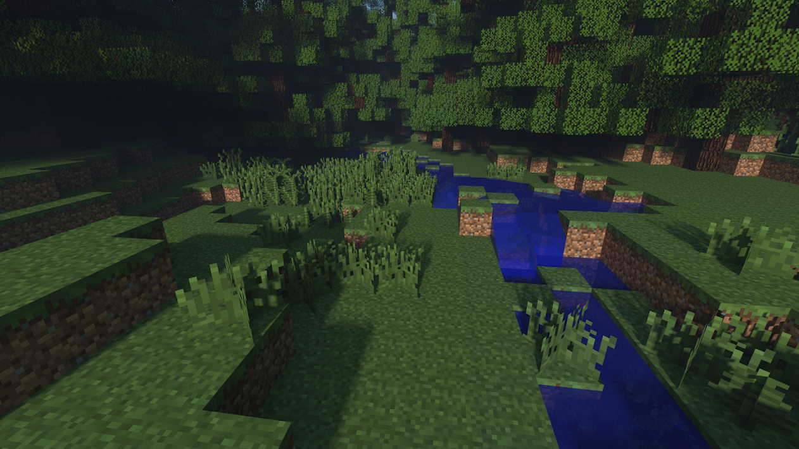

# Whitebox-tutorial
A guide for dummies by William Liberg

Reproducibility is a major principle of the scientific method and it is even more important for AI methods. Google colab is a good way to colaborate and share reproducable examples of working code. Whitebox-tools is avalible as python package https://pypi.org/project/whitebox/ which makes it possible to run on google colab. This tutorial demonstrates how to extract streams and watersheds from high resolution digital elevation models

Click the file named Whitebox_tools_in_colab.ipynb and open it in google colab
